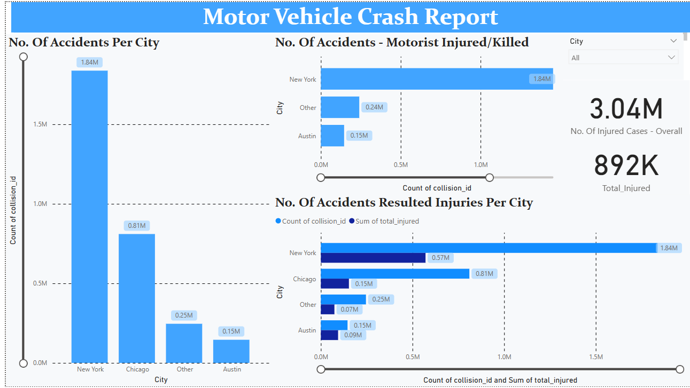
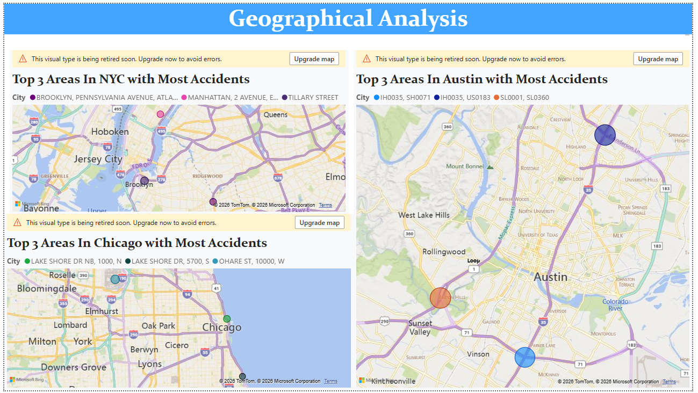
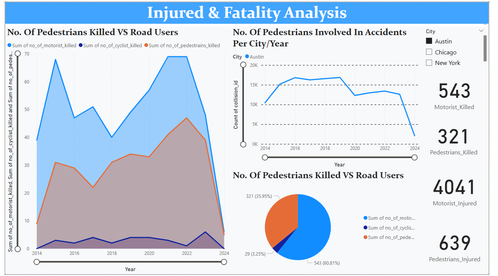
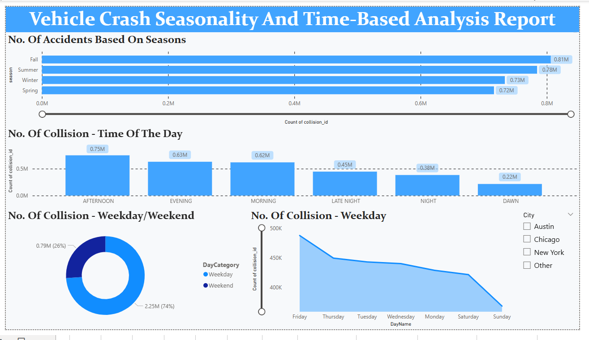

# Urban Traffic Crash: Big Data ETL Pipeline

An end-to-end big data engineering project analyzing **6M+ urban crash records** across Chicago & Dallas. This repository features a full ETL lifecycle from raw ingestion to real-time Power BI visualization.

## 📌 Project Overview
This project builds a scalable infrastructure to analyze metropolitan traffic accidents. By converting raw city data into a structured data warehouse, the pipeline enables deep-dive analytics into accident causes, locations, and time-based trends.

## 🛠 Tech Stack
* **ETL:** Talend, PySpark
* **Storage:** MySQL (Star Schema)
* **Analysis:** Python (EDA), T-SQL
* **Visuals:** Power BI, Tableau

## 🏗 Pipeline Workflow
* **Ingestion:** Automated fetching of 6M+ records.
* **Processing:** Distributed data cleaning and transformation using PySpark to ensure high-velocity processing.
* **Modeling:** Designed Fact and Dimension tables to support complex analytical joins.
* **Insights:** Developed SQL-based business logic to extract trends on driver behavior and road conditions.

## 📊 Power BI Dashboards

| **Strategic Analytics** | **Geospatial Mapping** |
| :--- | :--- |
|  |  |

| **Causal Factors** | **Time-Series Analysis** |
| :--- | :--- |
|  |  |

## 🚀 Highlights
* **Big Data Ready:** Architecture designed for high-volume data processing.
* **Structured for BI:** Optimized schemas that allow for sub-second report refreshes in Power BI.
* **Clean Code:** Modular SQL and Python scripts focused on reproducibility.

---
*Developed by [Chinmay Kulkarni](https://github.com/ckulkarni13)*
